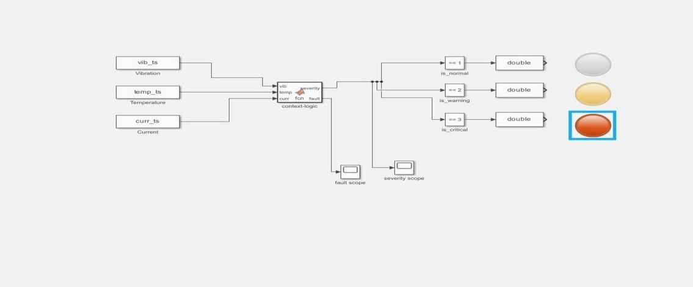

# Architecture

## Data path of one reading

1. **SW420** closes a contact as the motor housing vibrates; the ESP32 counts rising edges in a 2 s window.
2. **LM35** (GPIO 35) and **ACS712** (GPIO 32) are read through the 12-bit ADC. Current is measured as RMS over 200 ms (ten mains cycles at 50 Hz) after a 100-sample zero-offset calibration at boot.
3. The firmware classifies the reading against fixed thresholds and drives the LCD, LEDs and buzzer.
4. A JSON payload is published to topic `motor/all` over TLS MQTT (port 8883, username/password auth):
   ```json
   {"vibration": 4, "temperature": 59.3, "current": 3.41, "state": "Warning", "ts_ms": 1843021}
   ```
   `ts_ms` is the ESP32 uptime used for end-to-end latency measurement.
5. The dashboard subscribes over **WebSocket + TLS (port 8884)**, because Render's free tier restricts raw TCP on non-standard ports. A daemon thread pushes parsed messages into thread-safe 60-slot deques.
6. A Dash interval callback fires every 2 s and, from one shared buffer, computes: Random Forest probabilities, the 20 s forecast state, the Rising/Falling/Stable trend, and the alerts list.

## Why hybrid edge + cloud

| Concern | Edge (ESP32) | Dashboard |
|---|---|---|
| Must work with no network | ✔ thresholds, LEDs, buzzer | |
| Needs history and compute | | ✔ forest, forecast, trend |
| Explains *which* channel tripped | LCD state | ✔ per-channel alerts + probabilities |

This follows the hybrid recommendation in the literature: simple deterministic rules on the edge, a more capable probabilistic model downstream.

## Machine learning

- **Model:** `RandomForestClassifier(n_estimators=100)`; inference is well under a millisecond, far below the 2 s arrival cadence.
- **Features:** `[vibration, temperature, current]`, always in that order.
- **Training data:** ~1,000 synthetic samples (see `src/pdm/dataset.py` and the limitations in the README).
- **Forecast:** `numpy.polyfit(deg=1)` on the last 10 readings per channel, projected 10 steps ahead, classified by the *same* forest. One model means no second model to drift or retrain.
- **Trend:** mean of latest 5 vs previous 5 readings; a >5 % drift on any channel flags Rising (Rising wins ties). Small floors on the denominators stop near-zero baselines producing spurious percentage swings.

## Simulink

The decision logic was also captured as a Simulink model (`vib_ts`, `temp_ts`, `curr_ts` → context-logic MATLAB Function block → severity and fault-type outputs → indicator lamps and scopes). It serves as a design-review reference; the deployed logic is the C++ firmware and the Python package.


