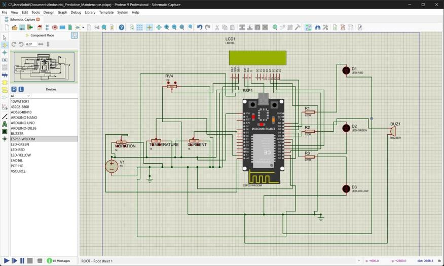
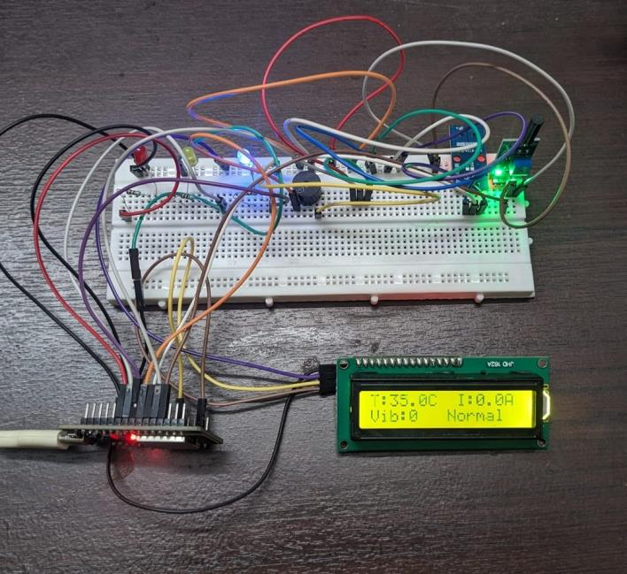

# Hardware

## GPIO map (ESP32-WROOM-32)

| GPIO | Direction | Connected to |
|---|---|---|
| 34 | Input | SW420 vibration sensor digital out |
| 35 | Analog input | LM35 temperature sensor output |
| 32 | Analog input | ACS712 output via 10 kΩ / 20 kΩ divider |
| 21 | I²C SDA | 16×2 LCD |
| 22 | I²C SCL | 16×2 LCD |
| 25 | Output | Red LED (Critical) |
| 26 | Output | Green LED (Normal) |
| 27 | Output | Yellow LED (Warning) |
| 33 | Output | Piezo buzzer (Critical only) |

LEDs use 220 Ω current-limiting resistors. Visual and audible outputs are on separate pins so one failed component does not silently disable the other.

## Design notes

- **ACS712 scaling.** The sensor swings around 2.5 V at 185 mV/A on a 5 V supply, which exceeds the ESP32's 3.3 V ADC range. A 10 kΩ/20 kΩ divider scales 5 V down to 3.3 V. A 100-sample zero-current calibration runs at boot because each sensor's offset differs slightly from 2.5 V. **Power up with the motor off.**
- **LM35 clamp.** Input-only pins can read near full scale when nothing is connected, which would show a bogus ~150 °C. The firmware rejects such readings and holds the last valid value. The sensor is bonded to the motor casing with thermally conductive epoxy.
- **SW420 calibration.** The trim pot sets sensitivity. It is adjusted to reject chassis vibration (printing press frame) or reciprocating piston impulses (compressor) so that only motor-originated events count.
- **Power.** The prototype runs from a 5 V phone charger over USB. A future PCB adds a 3.3 V LDO and screw terminals.
- **Mains safety.** The ACS712 sits in the motor's mains supply line. Work on a de-energised circuit and use properly insulated connections.

## Prototype

The LCD shows `T:35.0C I:0.0A` / `Vib:0 Normal` for a healthy idle motor, with the green LED lit.

## Components

| Component | Function |
|---|---|
| ESP32-WROOM-32 | Acquisition, local classification, MQTT |
| SW420 | Vibration pulses per 2 s |
| LM35 | Casing temperature, °C |
| ACS712 5 A | Motor current |
| 16×2 I²C LCD | Local readout |
| 3 LEDs | Normal / Warning / Critical |
| Piezo buzzer | Critical audible alert |
| 10 kΩ + 20 kΩ resistors | ACS712 level shifting |

Whole prototype: under ₹1,000.
