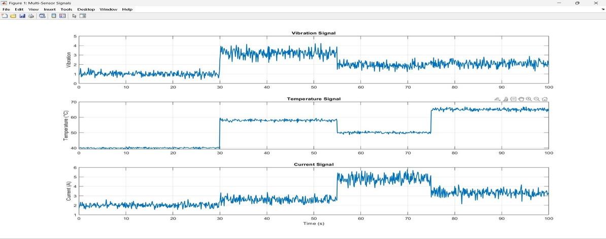
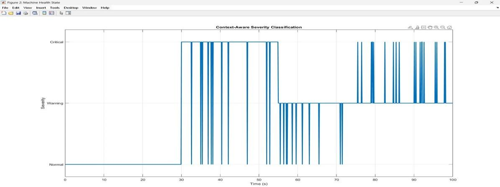
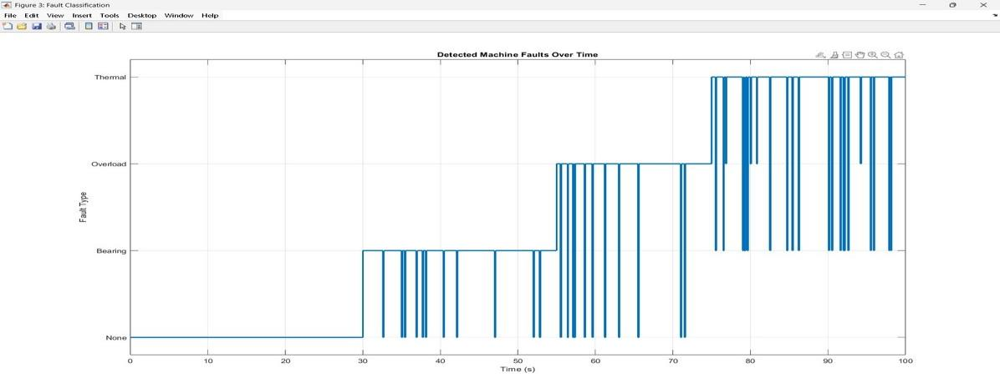
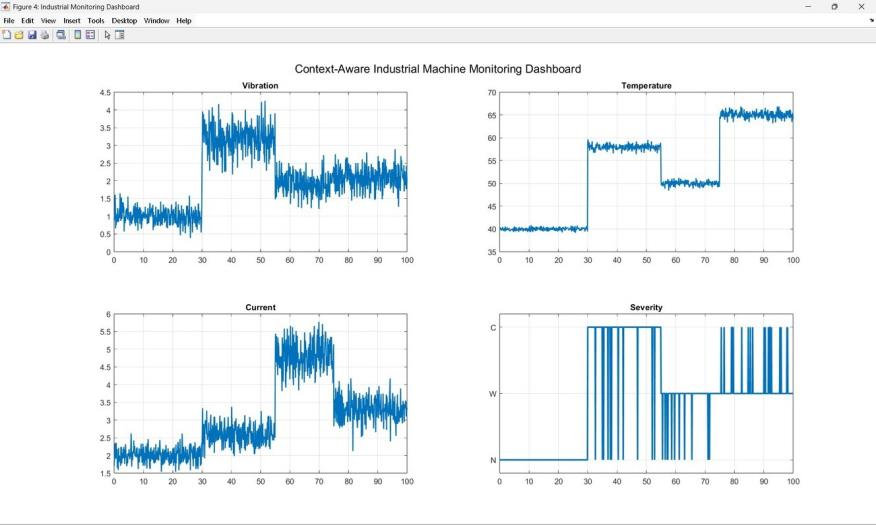

# Experimental results

## Test setup

A small single-phase laboratory induction motor in three regimes: no-load idle, ~60 % torque loading with a belt-driven load (close to rated current), and a simulated-fault regime. A **bearing fault** was emulated by mechanically perturbing the SW420 enclosure to mimic a degrading bearing's impulse pattern; a **thermal fault** by partially blocking the ventilation slots.

## Sensor behaviour over a 100 s run

- **Vibration:** ~1 pulse per window at idle, stepping to 3–4 after 30 s.
- **Temperature:** ~40 °C for the first 30 s, ~59 °C when the thermal fault engages, a partial recovery to ~50 °C between 55 s and 75 s, then ~65 °C.
- **Current:** ~2 A at idle, 4.5–5.5 A during the overload phase (55–80 s), then back down.

The three channels respond at different moments, and all are noisy, particularly vibration, which is consistent with contact-closure sensing. The rolling-window approach avoided state flicker once per cycle.

## Severity and fault type

Normal for the first 30 s; predominantly Critical from 30 to 55 s; Warning from 55 to 75 s as the thermal load eased (without dismissing the still-present mechanical fault); mixed Warning/Critical afterwards. Fault type progressed None → Bearing → Overload → Thermal, so a single-channel monitor would have seen one of the three transitions. (These plots come from the MATLAB/Simulink context logic.)

## Performance

| Indicator | Measured |
|---|---|
| MQTT connection after Wi-Fi association | within 3 s |
| End-to-end sensor-to-dashboard latency | 2 to 4 s (measured by stamping each reading with ESP32 uptime) |
| Forecast lead time before threshold crossing | 4 to 6 readings (8 to 12 s) |
| False positives during normal operation | None observed across back-to-back runs |
| Local LED / buzzer response on Critical | within one acquisition cycle |
| Bill of materials | under ₹1,000 |

During induced faults the Warning and Critical probability bars moved measurably *before* the firmware thresholds triggered, which suggests the model leads, rather than merely mirrors, the hard thresholds.

## Context

For a web offset press the 8–12 s forecast lead is enough to start a controlled slowdown instead of an emergency stop, avoiding a torn paper web and the long rethreading delay. On compressor motors the current channel typically reacts first, since valve wear and piston-rod imbalance raise mechanical load before vibration or bulk temperature change.

## Caveats

Results are from bench tests on a laboratory motor with simulated faults and a model trained on synthetic data. They demonstrate that the pipeline works end to end, not that it generalises to production machines. See the README limitations.
